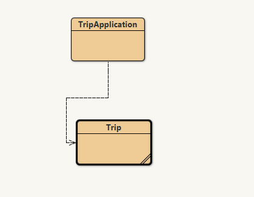

# ETS-PBO

**Nama** : Adyuta Prajahita Murdianto

**NRP** : 5025221186

**Kelas** : PBO A


---

## **1. Jelaskan perbedaan antara kelas dan objek, serta berikan contoh kode sederhana yang menunjukan hubungan kelas dan objek.**

`Kelas` adalah blueprint atau cetak biru yang menggambarkan atribut dan perilaku (method) apa saja dari suatu object yang akan dibuat, sedangkan `Objek` adalah instance atau realisasi dari suatu kelas. 

```java
public class Animal {
    public String name;

    public Animal(String name) {
        this.name = name;
    }

    public void makeSound() {
        System.out.println(name + " is making a sound.");
    }

    public void displayInfo() {
        System.out.println("Animal's name: " + name);
    }
}
```

```java
public class Main {
    public static void main(String[] args) {
        Animal myAnimal = new Animal("Dog");
        myAnimal.makeSound();
        myAnimal.displayInfo();
    }
}
```

Contoh diatas merupakan contoh dari kelas `Animal`, yang dimana memiliki atribut `nama`, serta method `kontruktor`, `makeSound`, dan `displayInfo`. `Objek` dari kelas ini akan dipanggil di `kelas` main dengan nilai parameter sebagai nama dari hewan yang akan di set di `konstruktor`. Lalu dipanggil method `makeSound` untuk mengeluarkan suara hewan, serta `displayInfo` untuk mencetak informasi dari objek hewan tersebut.

## **2. Buatlah aplikasi `CoffeeMachine` yang menyediakan kopi dengan harga tertentu.**

### **Kelas `Coffee`**

```java
public class Coffee {
    private String name;  
    private int price;     

    public Coffee(String name, int price) {
        this.name = name;
        this.price = price;
    }

    public String getName() {
        return name;
    }

    public int getPrice() {
        return price;
    }
}
```

Kelas yang merepresentasikan tiap kopi yang ada di `CoffeeMachine`. Setiap value atribut di set didalam method `kontruktor`, dan terdapat beberapa method `getter` untuk mendapatkan nilai dari masing-masing atribut. 

### **Kelas `CoffeeMachine`**

```java
public class CoffeeMachine {
    private ArrayList<Coffee> coffeeMenu;

    public CoffeeMachine() {
        this.coffeeMenu = new ArrayList<>();
    }

    public void addCoffee(String name, int price) {
        Coffee newCoffee = new Coffee(name, price);
        coffeeMenu.add(newCoffee);
    }

    public void displayMenu() {
        System.out.println("Available Coffee Menu:");
        for (int i = 0; i < coffeeMenu.size(); i++) {
            Coffee coffee = coffeeMenu.get(i);
            System.out.println(i + ". " + coffee.getName() + " - " + coffee.getPrice() + " units");
        }
    }

    public void buyCoffee(int index, int money) {
        if (index < 0 || index >= coffeeMenu.size()) {
            System.out.println("Invalid coffee selection.");
            return;
        }

        Coffee selectedCoffee = coffeeMenu.get(index);

        if (money >= selectedCoffee.getPrice()) {
            System.out.println("Serving " + selectedCoffee.getName() + ". Enjoy your coffee!");
        } else {
            System.out.println("Not enough money. " + selectedCoffee.getName() + " costs " + selectedCoffee.getPrice() + " units.");
        }
    }
}
```

Kelas yang merepresentasikan mesin kopi berfungsi sebagai kelas utama dari mesin kopi. Memiliki atribut `coffeeMenu` berupa array list yang berfungsi menyimpan objek-objek `Coffee`. Kelas `konstruktor` berfungsi untuk menginisiasi atribut `coffeeMenu` dengan array list kosong. Method `addCoffee` berfungsi untuk menambahkan kopi ke array `coffeeMenu`. Method `displayMenu` berfungsi untuk menampilkan seluruh kopi yang ada dialam array `coffeeMenu`. 
Terakhir, method `buyCoffee` berfungsi sebagai method untuk membeli kopi.

## **3. Apa yang dimaksud `enkapsulasi`. Berikan contoh dengan dengan menggunakan modifier private dengan motede akses (`getter` dan `setter`).**

`Enkapsulasi` adalah konsep keamanan dalam konsep PBO, yang dimana konsep ini akan menyembunyikan atribut-atribut yang ada didalam kelas. Terdapat 3 tingkatan dalam `Enkapsulasi`, 

**Public**

Dapat diakses dari luar (tanpa keamanan).

**Protected**

Hanya bisa diakses dari kelas tersebut beserta kelas turunannya.

**Private**

Hanya bisa diakses didalam kelas tersebut.

Berikut contoh penggunaan dengan modifier `private` serta `getter` dan `setter` nya,

```java
public class Coffee {
    private String name;  
    private int price;     

    public Coffee(String name, int price) {
        this.name = name;
        this.price = price;
    }

    public String getName() {
        return name;
    }

    public void setName(String name) {
        this.name = name;
    }

    public int getPrice() {
        return price;
    }

    public void setPrice(int price) {
        this.price = price;
    }
}
```

Disini karena atribut `name` dan `price` merupakan atribut `private`, maka disini menggunakan method `getter` (`getName` untuk `name` dan `getPrice` untuk `price`) untuk mendapatkan nilai dari atribut, dan `setter` (`setName` untuk `name` dan `setPrice` untuk `price`) untuk set value dari atribut.


## **4. Buatlah kelas `BankAccount` dan `Customer`, yang dimana objek customer memiliki akun bank masing-masing, serta method untuk setor uang (`deposit`) dan tarik uang (`withdraw`). Pastikan interaksi terjadi di objek customer**

### **Kelas `BankAccount`**

```java
public class BankAccount {
    private double balance;

    public BankAccount(double initialBalance) {
        this.balance = initialBalance;
    }

    public void deposit(double amount) {
        if (amount > 0) {
            balance += amount;
            System.out.println("Successfully deposited: " + amount);
        } else {
            System.out.println("Deposit amount must be positive.");
        }
    }

    public void withdraw(double amount) {
        if (amount > 0 && amount <= balance) {
            balance -= amount;
            System.out.println("Successfully withdrew: " + amount);
        } else {
            System.out.println("Insufficient balance or invalid amount.");
        }
    }

    public double getBalance() {
        return balance;
    }
}
```

Kelas ini memiliki atribut `balance` sebagai representasi dari saldo pada akun bank. Lalu terdapat method `konstruktor` yang akan menginisiasi nilai dari `balance` dengan saldp awal. Selanjutnya terdapat method `deposit` yang berfungsi untuk menyetor uang kedalam atribut `balance` dan method `witbdraw` untuk penarikan `balance`. Terakhir, method `getBalance` digunakan untuk mendapatkan isi saldo dari akun bank.

### **Kelas `Customer`**

```java
public class Customer {
    private String name;
    private BankAccount account;

    public Customer(String name, double initialBalance) {
        this.name = name;
        this.account = new BankAccount(initialBalance);
    }

    public void deposit(double amount) {
        account.deposit(amount);
    }

    public void withdraw(double amount) {
        account.withdraw(amount);
    }

    public void checkBalance() {
        System.out.println("Balance for " + name + ": " + account.getBalance());
    }
}
```

Kelas ini memiliki atribut `name` sebagai nama dari customer dan `account` dengan tipe data kelas `BankAccount` yang merupakan akun bank dari customer. Lalu terdapat method `konstruktor` yang akan set value dari `name` dan `account`. Lalu terdapat method `deposit` yang akan memanggil method `deposit` dari `account` untuk setor uang dan method `withdraw` yang akan memanggil method `withdraw` dari `account` untuk tarik uang. Terakhir terdapat method `checkBalance` untuk mendapatkan total saldo dengan memamggil methdo `getBalance` dari `account`.

## **5. Buat Desain Class Diagram untuk `Trip Application`. Setiap perjalanan memiliki atribut `destination`, `distance` dan `costPerKM`. Aplikasi memiliki fitur menghitung total biaya berdasarkan jarak, menambah penumpang, dan membatalkan perjalanan jika penumpang kurang dari minimum**

**Kelas Trip**

```java
import java.util.ArrayList;

public class Trip {
    private String destination;
    private double distance;  
    private double costPerKm; 
    private ArrayList<String> passengers; 
    private int minPassengers; 

    public Trip(String destination, double distance, double costPerKm, int minPassengers) {
        this.destination = destination;
        this.distance = distance;
        this.costPerKm = costPerKm;
        this.passengers = new ArrayList<>();
        this.minPassengers = minPassengers;
    }

    public void addPassenger(String passengerName) {
        passengers.add(passengerName);
        System.out.println("Passenger " + passengerName + " added.");
    }

    public void printPassengers() {
        System.out.println("Passenger list for trip to " + destination + ":");
        for (String passenger : passengers) {
            System.out.println(passenger);
        }
    }

    public double calculateTotalCost() {
        return distance * costPerKm;
    }

    public boolean cancelTripIfTooFewPassengers() {
        if (passengers.size() < minPassengers) {
            System.out.println("Trip to " + destination + " canceled. Not enough passengers.");
            return true; 
        } else {
            System.out.println("Trip to " + destination + " is confirmed.");
            return false; 
        }
    }
}

```

**Kelas TripApplication**

```java
public class TripApplication {
    public static void main(String[] args) {
        Trip trip1 = new Trip("Bali", 300, 2.5, 3);

        trip1.addPassenger("John");
        trip1.addPassenger("Alice");

        trip1.printPassengers();
an
        System.out.println("Total trip cost: " + trip1.calculateTotalCost() + " units.");

        trip1.cancelTripIfTooFewPassengers();

        trip1.addPassenger("Bob");

        trip1.printPassengers();

        trip1.cancelTripIfTooFewPassengers();
    }
}

```




## **Demo**

<iframe width="560" height="315" src="https://www.youtube.com/embed/nQzraMrCsK8" frameborder="0" allow="accelerometer; autoplay; clipboard-write; encrypted-media; gyroscope; picture-in-picture" allowfullscreen></iframe>

